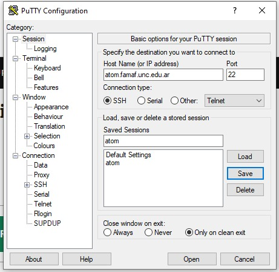
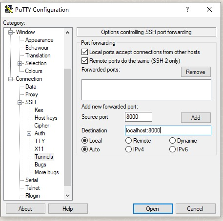
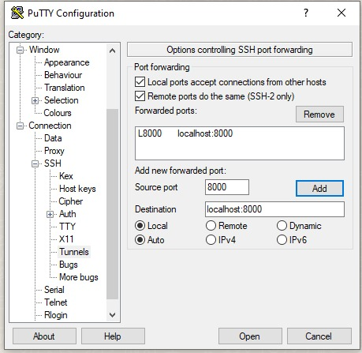
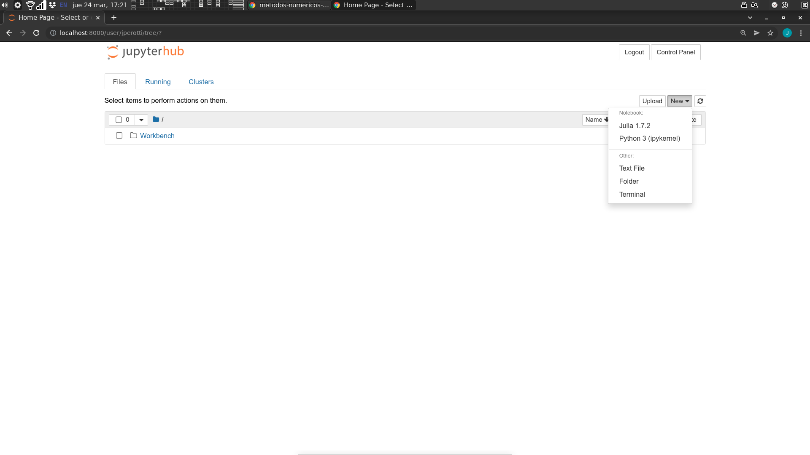

## Instrucciones de como acceder a la instancia de jupyterhub de FaMAF

En la Facultad tenemos instalado (gracias a Nicolás Wolovick) un servidor de jupyterhub. 
Para acceder a el se necesita: 

1. tener una cuenta en la computadora `atom` la cual será provista a todos los alumnos del curso.

2. tener un cliente de ssh (secure shell) en su computador personal. En linux viene por defecto, para Windows se puede usar uno llamado Putty.exe (https://www.putty.org/)
3. Tener un browser.

Una vez que tenga su `usuario` y `contraseña` deberá conectarse a la computadora `atom` de FaMAF por medio de una conexión con tunel (es decir, una conexión por internet a travéz de un puerto de comunicación seguro). 

### Desde Linux
Para establecer dicha conexión, desde una terminal linux, ingrese la siguiente línea de comando 

`mi computadora> ssh -L 8000:localhost:8000 usuario@atom.famaf.unc.edu.ar`

donde debe remplazar `usuario` por su nombre de usuario. Por ejemplo, si su nombre de usuario es `juan.perez`, remplaze `usuario` por `juan.perez`.

Una vez ejecutada la linea de comando, le aparecerá la solicitud de contraseña y una vez que la haya ingresado con éxito en la terminal podrá ingresar comandos en la computadora remota (`atom`). **Continúe luego de las instrucciones para Windows.**

### Desde Windows

Descargue el cliente de ssh (Putty)(https://www.putty.org/)

Abra la aplicación e ingrese la dirección (nombre) de atom. 
Puede grabar la información para no tener que repetirla en el futuro.

A continuación vaya a ssh -> Tunnel y complete la información como se indica. No olvide los tildes en las casillas arriba. 

Pulse `ADD` para guardar los datos ingresados.

Ahora inicie la conexión. Le aparecerá el siguiente cartel:

Es una noticia de que esa conexión no estaba en sus registros. Pulse `aceptar`.

Si todo anda bien aparecerá una pantalla donde deberá ingresar su usuario.
Luego aparecerá una indicación de que ingrese su clave. *Cuando lo ingrese parecerá que no lo está haciendo* 
eso es por motivos de seguridad. Si es correcto estará en condiciones de ingresar datos en una pantalla de terminal.

### Luego del ingreso: 

#### Primero que nada CAMBIE SU CLAVE! 

Para ello use el comando `passwd` (primero deberá ingresar la clave actual y luego le pedirá dos veces la nueva).

#### Trabajando con jupyterlab

Para trabajar con **jupyterlab** debemos primero instalar los paquetes IJulia y Plots en el Julia instalado en la computadora atom de FaMAF. Estos paquetes permitirán que el Jupyter que viene instalado en Jupyterhub reconozca a Julia.

1. En la terminal de linux en atom escriba `julia <enter>`. Con esto Debería ingresar a una terminal REPL de julia 1.7.2
2. Dentro de la termina REPL de Julia ingrese: `using Pkg; Pkg.add("IJulia"); Pkg.add("Plots") <enter>`.
3. A continuación habra su browser e ingrese la dirección:

`http://localhost:8000`

Le deberá aparecer una pantalla del Jupyterhub remoto en esa dirección. Desde allí, deberá poder ver en **New** la opción de poder crear una notebook de Julia.

4. Para terminar la conección, cierre las páginas abiertas via el puerto `8000`. Cierre la consola REPL de Julia presionando <Ctrl D> y volverá a la terminal de linux en atom. Podrá salir de esta ingresando `exit`.
